# Apache Flink

<table><tr><td>

**_Apache Flink_** is a **stream** and **batch** processor widely used for demanding real-time applications (most commonly in conjunction with **_apache kafka_**).

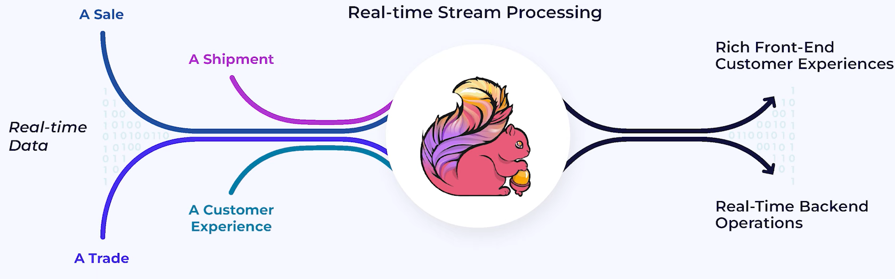

</td><td>

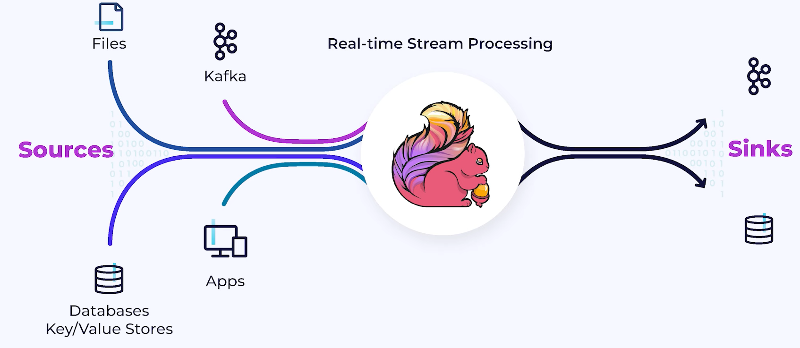

</td></tr></table>

A **_stream_** is a sequence of **_events_** that can be manipulated, processed, and reacted to in real-time; in which case the sequence of events forms an **unbounded** _stream_ that extends indefinitely into the future (can also be stored for later retrieval, etc.). Reprocessing a batch of historical data is then a special case of **bounded** _streaming_.
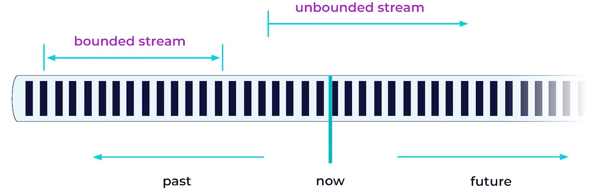

A running _Flink_ application, **_Job_**, can have multiple data-processing pipelines, each called a **_Job Graph_** (event data is treamed through them) (topology). Each **_node_** inside a job graph represents a processing steps in the pipeline, each executed by an **_operator_**. _Operators_ transform event _streams_ and are connected to one another by **_connections_**, represented as the graph (directed) edges. _Job graphs_ are always **directed acyclic**; where the event data is always flowing from the **_sources_** to the **_sink_** (processed along the way by the _operators_).

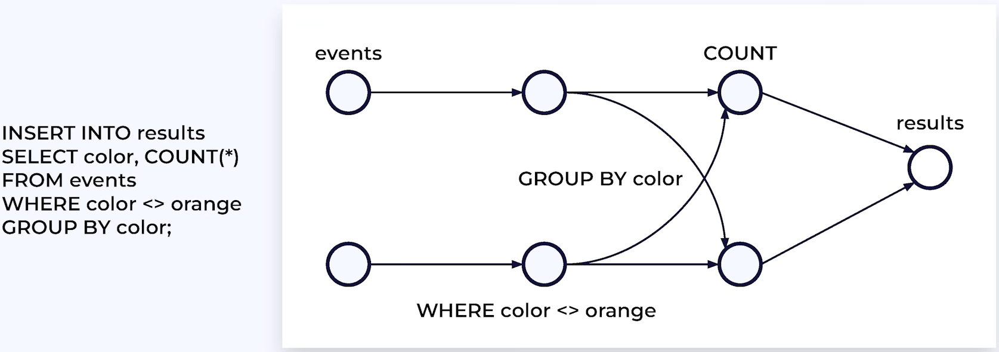

_Stream_ processing is done in parallel by partitioning event _streams_ into parallel _sub-streams_, each of which can be independently processed (crucial for scalability). These independent parallel _operators_ **share nothing**, and can run at full speed (typical for input to a _Flink Job_ can be consumed in parallel, and often pre-partitioned upstream of _Flink_).

## Flink SQL

**_Flink SQL_** is one of the APIs available for _Apache Flink_, facilitating a standards-compliant SQL engine for processing both batch and streaming data with the scalability, performance, and consistency of _Apache Flink_.

<table><tr><td>

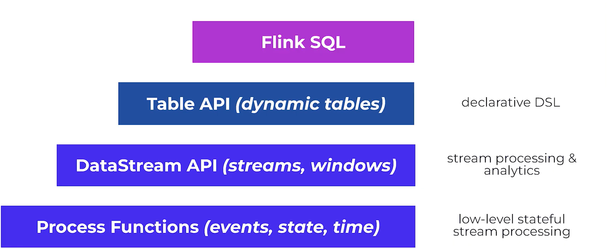

</td><td>

API code layered in _Flink_:

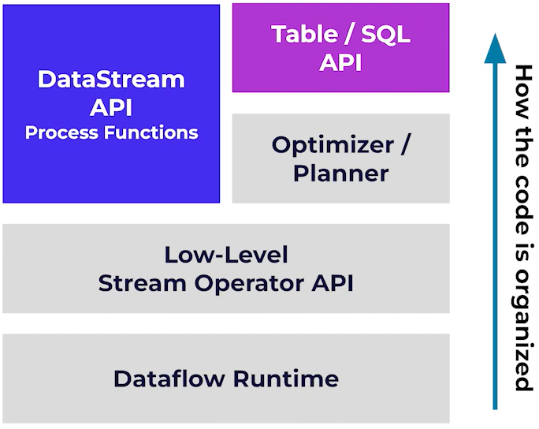

</td></tr></table>

**_Process Functions_** is a primitive building block capable of implementign almost any operation by directly manipulating _Flink's_ state backends and timer services (writing code that reacts to each event as it arrives; one at a time). **_Datasteam API_** encompasses _process functions_ at a slightly higher level of abstraction (streams, windows, etc.). **_Table API_** abstracts these further with capabilities similar to _Flink sql_ though code must be written in Java or python rather then sql. Note that all these are interoperable.

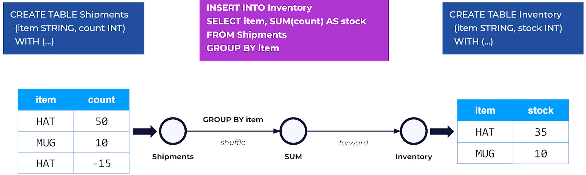

_Flink SQL_ engine can feel very much like using a database; but it is not really a database. It is only using standard sql syntax to describe the processing desired of _Flink_. None of the data is stored in _Flink_; when a table is created in _Flink_, it only describes data stored elsewhere.

<table><tr><td>

```sql
CREATE TABLE Shipments (
    item    STRING,
    count   INT,
) WITH (
    'connector'='kafka',
    'topic'='shipments',
    'value.format'='json',
    'properties.group.id'='myGroup',
    'scan.startup.mode'='latest-offset',
    'properties.bootstrap.servers'='XXX',
    'Properties.security.protocol'='SASL_SSL',
    'Properties.sasl.mechanism'='PLAIN',
    'Properties.sasl.jaas.config'='XXX'
)
```

_Flink SQL_ tables do not store data, instead are backed by a provider/producer with _Flink_ only maintaining metadata to describe the schema and connector properties required to ingest the data correctly.

</td><td>

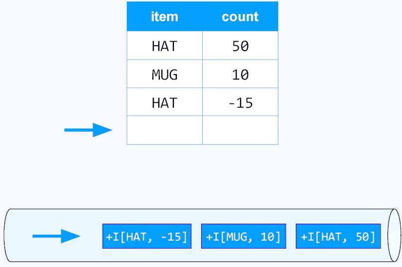
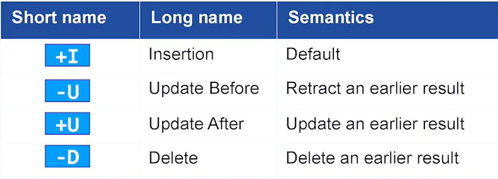
In _Flink SQL_ there exists a stream/table duality; "tables" are _dynamic tables_ which change over time and every table is equivalent to a stream of events describing the changes being made to that table (**_changelog stream_**).

</td></tr></table>

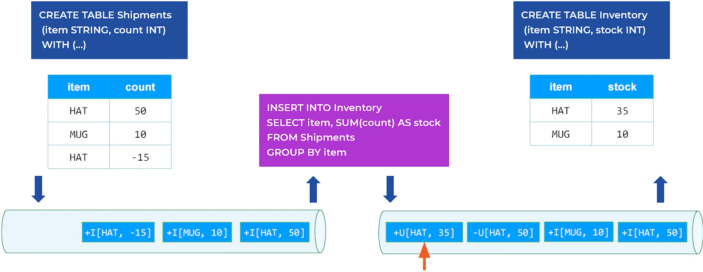

The _Flink_ applications deployed by the various APIs, become **_Flink clients_** which generate the _job graphs_ for a given job and submit it to teh **_Job Manager_**. The _job manager_ will then find or create the resources required for the job (spin as many **_task manager_** nodes as needed, etc.); and Once the job is running, the _job manager_ remains responsible for coordinating the activities of teh _Flink_ cluster (checkpointing, restart, etc.). _Task managers_ provide **_task slots_** which each can process one parallel instance of the _job graph_. _Task managers_ are responsible for pulling the data from teh source, transform it, send data to each other for repartitioning and rebalancing, and push results out to the sinks.

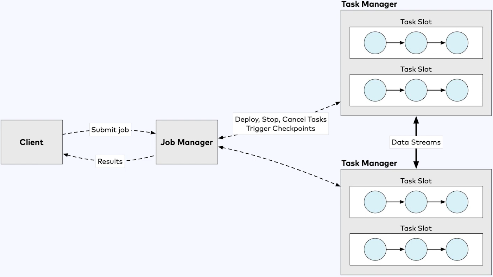

## Stateful Stream Processing
The only stream processing operations that can be performed without any state are those that apply simple filters or transformations that can be executed solely on the basis of the content of the event being processed. All other operations (`COUNT`, `JOIN`, etc.) require some state to be kept; most comonly in a distributed key-value store with each parallel instance managing the state for a set of keys. 
- To achieve high performance, Flink keeps its state local to each processing node. 
- To provide fault tolerance, Flink periodically ***checkpoints*** the states; copying them to a remote durable object store (S3, etc.)

<table><tr><td>


</td><td>


</td></tr></table>
The reson why materializing operations are considered dangerous because they need to maintain at all times, and indefinitely, an internal copy of the data related to the query. This can potentially lead to exponential increases in storage usage depending on the query (unbounded requirement for storage), leading to reduced performance and eventual failure of the job.

A way to avoid the state retention problem, is to impose temporal constraints on state operations. These operations still maintain a state in a materialized view but has a predictive and finite lifetime (unlike materializing operations). 

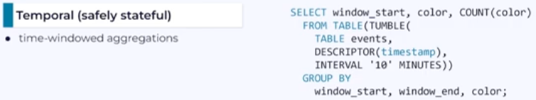

https://nightlies.apache.org/Flink/Flink-docs-master/docs/dev/datastream/operators/windows/

## Event Time and Watermarks
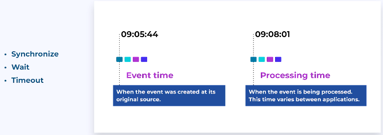

*Flink* distinguishes between ***event time*** (time when the event was created, generally preferred due to consistency) and ***processing time*** (time when the event is processed)

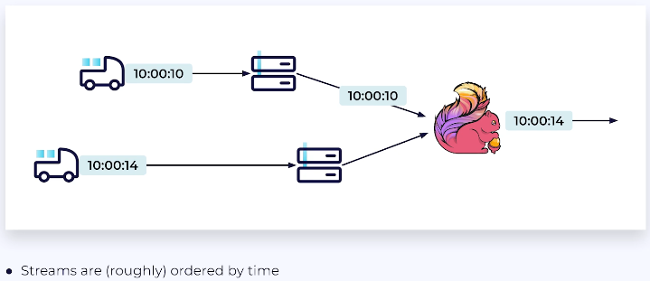

When working in *event time*, it is possible for event streams to be perfectly in order by time; but very often, event streams are only approximately ordered by their timestamps. This can happen whenever events can take different paths, and experience different delays; especially common in situations involving mobile devices where the event that occured a few seconds later ends up being processed first because it experiences less delay than the earlier event.
- Imagine a window counting events for the hour ending at 14:00, how long should this window wait before producing its results? Obviously the window cannot look ahead in teh stream to determine if its safe to produce teh final count, and so a heuristic method needs to be implemented to identify when the window is probably complete. 

This decision is in essence dependent on how out of order the stream is (if stream is perfectly in order by time, it will quickly decide when to end the window as opposed to randomly ordered data). *Flink*'s `WATERMARK`s are generated by assuming an out-of-orderness estimate, with each subsequent watermark being calculated as the max timestamp seen so far minus that estimated assumption. These then assert something about teh completeness of the stream with respect to time; specifically, asserting that the stream is not complete up to, but not including, 14:00, and no earlier events are expected to follow (still possible but are not expected). 
- If earlier events are recieved after teh watermark asserted the completion of their window, this violates teh assumption for the out-of-orderness estimate and such events are considered "late".

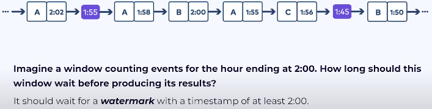

*Flink*'s window operator relies on watermarks (produced by watermark generator that run inside of *Flink*'s *kafka* consumer) to know when to produce results:
<table><tr><td>

$\min\{\text{incoming WMs}\}=\text{No WM}$ as source lacks any events for partition 1, and so does not have any useful watermark.

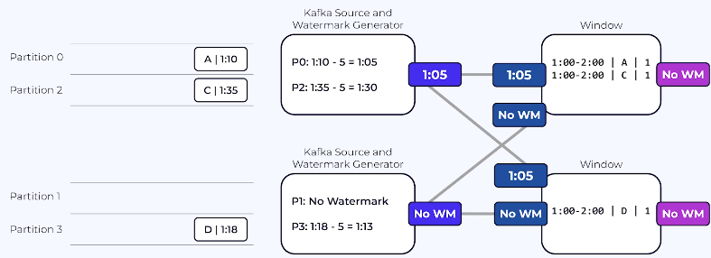
</td><td>

$\min\{\text{incoming WMs}\}=1:05$ as both sources have useful watermarks that can then flow downstream.

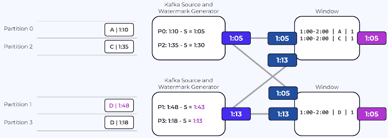
</td></tr></table>

**Note** that out-of-orderness is much smaller than 5min, actual formula used computes watermark -1ms, and **No WM** is actually $-2^{63}$

## Checkpoint and Recovery

A ***checkpoint*** is an automatic snapshot created by *Flink*, primarily used for the purpose of feilure recovery; while ***savepoints*** on teh other hand are manual snapshots created for some operational purposes (a stateful upgrade, etc.).

The Flink runtime is automatically taking periodic snapshots of all the relevant state:
- Each of the parallel sources has written into the snapshot the current offset for each partition it is responsible for. 
- Filter operations are stateless and thus does not contribute to the snapshot. 
- Each of the parallel counting tasks write into the snapshot the counters for the color it is responsible for; reflecting teh state after having consumed all of the events from teh sources up to, but nothing past, the offsets recorded by teh source tasks.
- The sink writes into its part of the snapshot the ids of the transactions which committed teh results it produced after consuming every event up to, but not beyond those same offsets defined by the sources.

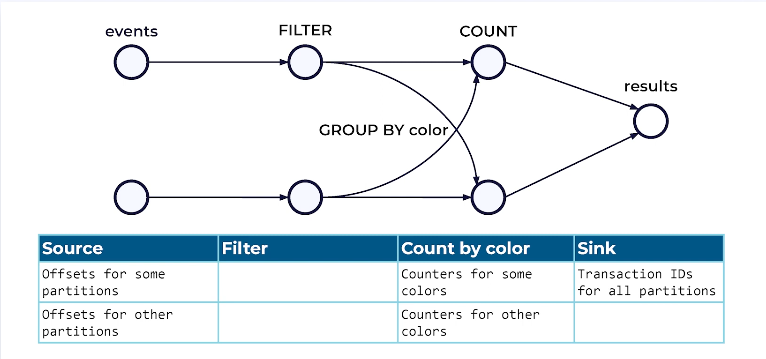

This orginization of the snapshot means it is a globally self-consistent snapshot of all of teh state for this job from all across the *Flink* cluster. This means that *Flink* provides (effectively) exactly-once guarantees.

Sometimes it happens that task managers fail (code throws exception, etc.) and when this happens the job manager will detect the failure and depending on the restart strategy that has been configured, arrange for the job to be restarted using the most recently defined snapshot.