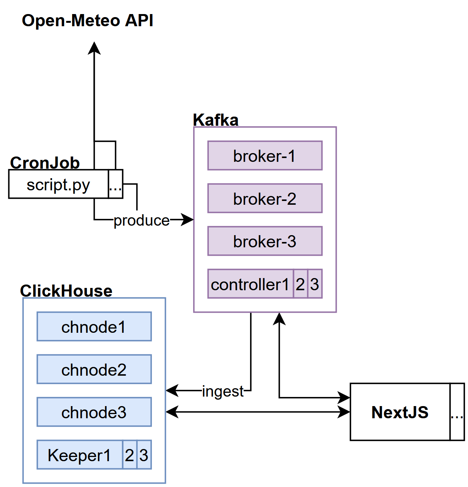
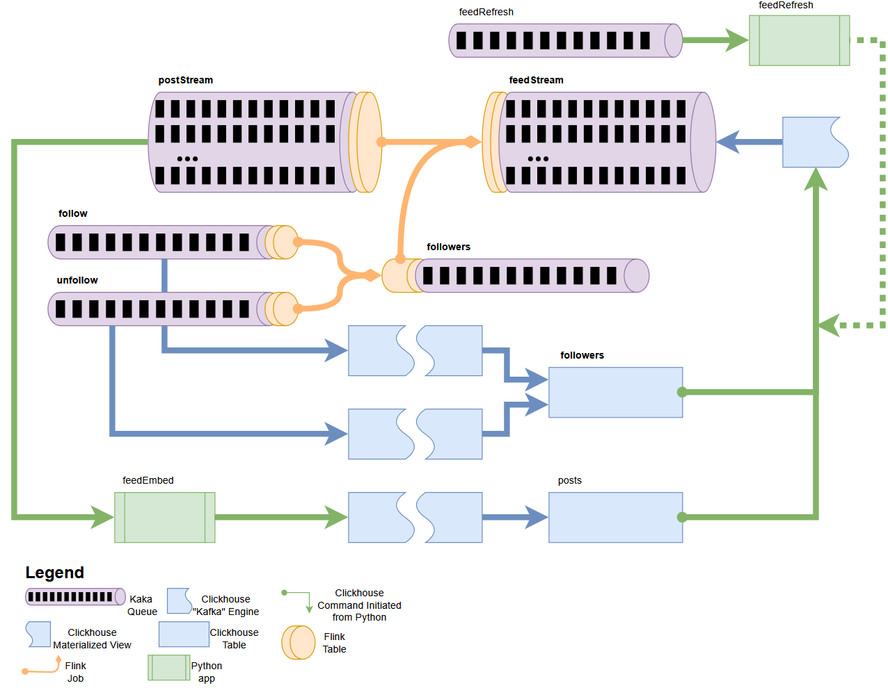

# Raindance

Raindance is a weather speculation app (POC)

**_ClickHouse_** (https://clickhouse.com/) is an open-source distributed-column-oriented DBMS for Online Analitical Processing (OLAP). Apache **_Kafka_** (https://kafka.apache.org/) is an open-source distributed event streaming platform. Apache **_Flink_** (https://flink.apache.org/) is an open-source framework and distributed processing engine for stateful computations over unbounded and bounded data streams. **_CronJob_** is an open-source job scheduler on unix-like systems. **_Next.js_** (https://nextjs.org/) is an open-source web development framework providing React-based web application with server-side (and static) rendering.

## Social Media Feed Engine

Old Architecture

New Architecture

