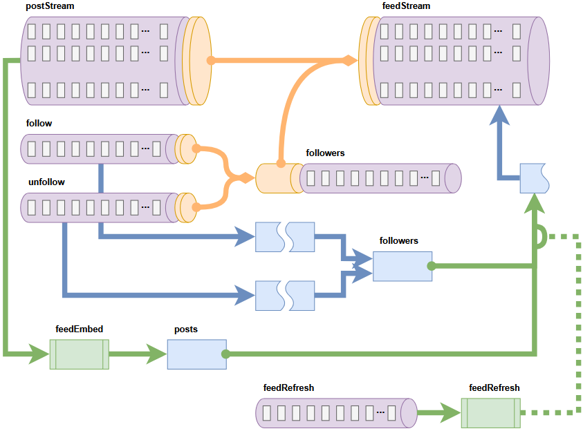

# Raindance

Raindance, a weather speculation app (POC) that turns every forecast into a social adventure. Tap into a vibrant community of “weather whisperers” to share your predictions, challenge friends with live forecasting games, and earn bragging rights as your accuracy rises. With intuitive charts, real-time radar overlays, and customizable alerts, Raindance makes tracking storms, sunny spells, and snow flurries exciting and interactive. Whether you’re a casual sky-watcher or a devoted storm chaser, connect with fellow enthusiasts to compare forecasts, swap tips, and celebrate when your predictions come true—because at Raindance, predicting tomorrow’s weather is more fun when you do it together.

## Technology interactions
The following technologies are used in this project to deliver a microservice architecture that allows independent development and scaling to reflect production environments. 

**_ClickHouse_** (https://clickhouse.com/) is an open-source distributed-column-oriented DBMS for Online Analitical Processing (OLAP). Apache **_Kafka_** (https://kafka.apache.org/) is an open-source distributed event streaming platform. Apache **_Flink_** (https://flink.apache.org/) is an open-source framework and distributed processing engine for stateful computations over unbounded and bounded data streams. **_CronJob_** is an open-source job scheduler on unix-like systems. **_Next.js_** (https://nextjs.org/) is an open-source web development framework providing React-based web application with server-side (and static) rendering. **_MinIO_** (https://min.io/) is a high-performance _S3_ compatible object storage system for unstructured data, used to their storage and retrieval.

All these technologies were chosen due to their specific capabilities, open-source licenses, and their compatability with **_docker_** which was used to facilitate all the containerisation and hosting. The high-level interactions between these techologies are as follows.

## Social Media Feed Engine

